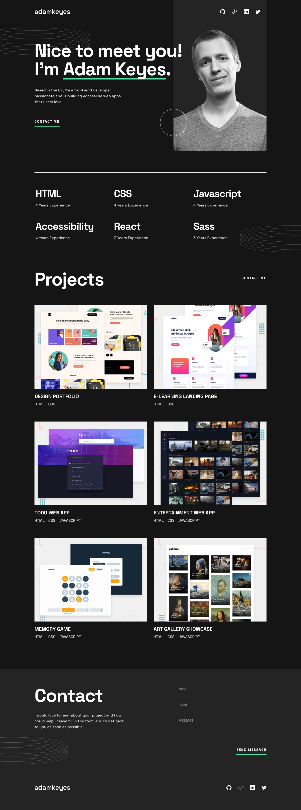
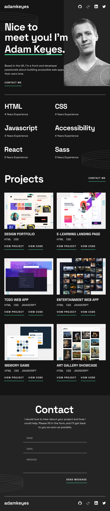
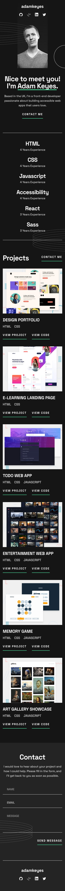
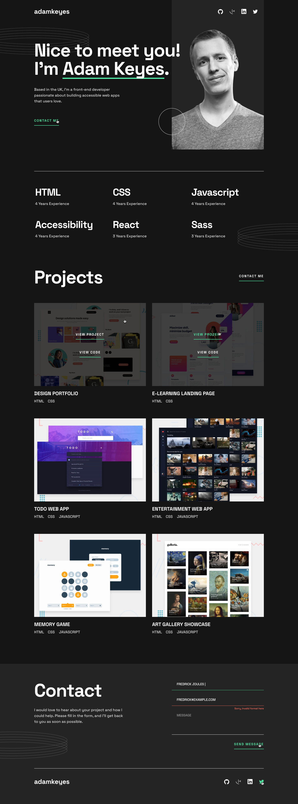

# 🧑‍💻 Portfolio - Responsive Website

Responsive multipage website about a protfolio.  
Built using a modular architecture with **Vite**, **Sass (SCSS)**, and modern frontend best practices.

This project was developed as a frontend practice focused on responsive design, layout structure, and improved workflow organization compared to previous projects.

---

## 🚀 Live Demo

👉 **[View Live Project](https://cris100fire.github.io/portfolio/)**

---

## 📸 Screenshots

### 📸 Home Page

  
  
  

---

### 📸 Active Home Page

  

---

## 🛠️ Technologies Used

- 
- 
- 
- 
- 
- 
- 
- 

---

## ✨ Features

- Fully responsive design (mobile, tablet, desktop)
- Modular Sass architecture
- Organized project structure using Vite
- Optimized production build

---

## 📦 Installation & Use

- Clone the repository: `git clone` https://github.com/Cris100Fire/portfolio.git
- Install dependencies: `npm run install`
- Run development server: `npm run dev`
- Build for production: `npm run build`
- Preview production build: `npm run preview`

---

## 📚 What I Learned

With this project, I reinforced and improved concepts from my previous work:

- Building a fully responsive layout from scratch
- Structuring a multipage project using Vite
- Better Sass responsibility distribution (layout, components, utilities)
- Improving deployment workflow compared to earlier repositories
- Writing cleaner and more maintainable SCSS files

This project focused on strengthening responsive design skills and improving overall project organization.

---

## 📌 Responsiveness

This website is fully responsive and optimized for:

- 📱 Mobile devices
- 📲 Tablets
- 💻 Desktop screens

The layout adapts smoothly across breakpoints using Flexbox, Grid, and a mobile-first workflow.

---

## 🚀 Future Improvements

- Add subtle animations and micro-interactions
- Improve accessibility (ARIA roles, semantic HTML refinement)
- Enhance performance optimization
- Improve SEO structure
- Add CMS integration for dynamic content

---

## 🤝 Contributions

Contributions are welcome! If you find any problems or have any suggestions for improvement, please open an issue or submit a pull request!

---

## 👨‍💻 Author

Developed by **Cristopher Cienfuegos**

---

## 📄 License

This project is licensed under the MIT License.
